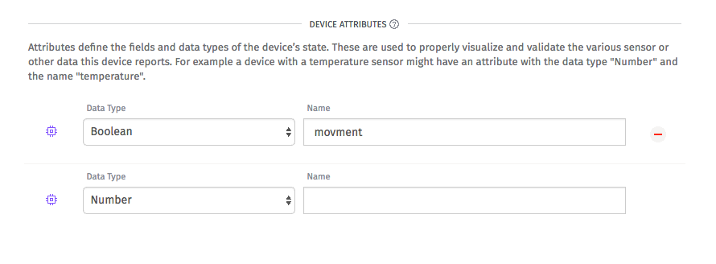
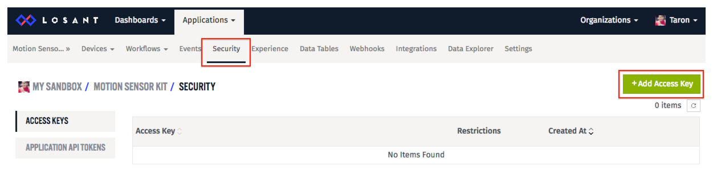
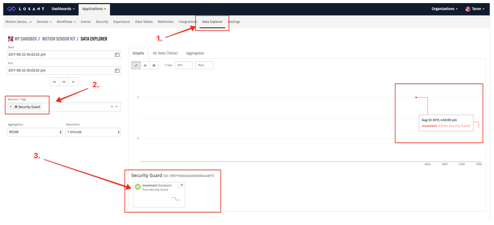

# Detecting Motion Using a PIR sensor, ESP8266, and Mongoose OS. 

This example application is a motion detector. It uses the ESP8266 NodeMCU and a PIR sensor. This example code is apart of a [tutorial](https://www.losant.com/blog/detecting-motion-using-a-pir-sensor-esp8266-and-mongoose-os). The tutorial demonstrates how to send the data to the [Losant IoT Platform](https://www.losant.com), where we can create a dashboard to monitor activity, and send alerts based on customizable rules.

## Tested Hardware
- ESP8266
- ESP32

## Installation & Flashing

Before beginning, you must have the `mos` tool installed. For more info, see the mos [installation instructions](https://mongoose-os.com/docs/quickstart/setup.html). 

1. First, clone the losant app

```
$ git clone git@github.com:Losant/losant-mongoose-motion-sensor.git
```

2. Build the firmware: (esp8266 or esp32)

```
$ mos build --arch esp8266 
```

3. Flash the device: (esp8266 or esp32)

```
$ mos flash 
```

4. Configure WiFi:
```
mos wifi WIFI_SSID WIFI_PASSWORD 
```
You must replace the following values:
- WIFI_SSID
- WIFI_PASSWORD

5. Login to Losant service. Create and app, device, and security credentials for your device:
The device will have the following attributes: 

Here is where you can obtain security crendentials: 


6. Configure MQTT connection to Losant:
```
mos config-set mqtt.client_id=LOSANT_DEVICE_ID \
  mqtt.user=LOSANT_ACCESS_KEY \
  mqtt.pass=LOSANT_ACCESS_SECRET
```  

You obtain the `LOSANT_DEVICE_ID`, `LOSANT_ACCESS_KEY`, and `LOSANT_ACCESS_SECRET` values from [Losant](www.losant.com). 

7. To stream logs to the terminal: 

```
$ mos console
```

8. To open up the mos web UI:

```
$ mos
```

9. Switch back to Losant page, watch data graph:


